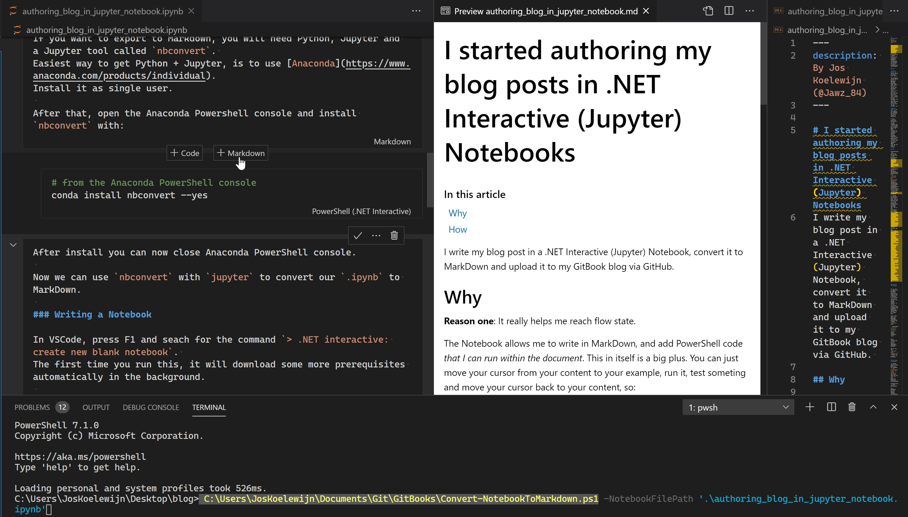

# I started authoring my blog posts in .NET Interactive \(Jupyter\) Notebooks

I write my blog post in a .NET Interactive \(Jupyter\) Notebook, convert it to MarkDown and upload it to my GitBook blog via GitHub. AND I LOVE IT!



## Why

**Reason one**: It really helps me reach flow state.

The Notebook allows me to write in MarkDown, and add PowerShell code _that I can run within the document_. This in itself is a big plus. You can just move your cursor from your content to your example, run it, test someting and move your cursor back to your content, so:

**Reason two**: I am sure _all_ my examples are working and their output is accurate.

It also _captures the output_ of the script/command that I ran within the document. When I am done writing, I restart the notebook kernel running PowerShell \(start a new PowerShell session\) and run all my examples again. This way all code is tested.

## How

Prerequisites for authoring and running a .NET Interactive Notebook

* [VSCode Insiders](https://code.visualstudio.com/insiders/) \*\)
* [.NET 3.1 SDK](https://dotnet.microsoft.com/download/dotnet-core/3.1)
* [VSCode Extension .NET Interactive Notebooks](https://marketplace.visualstudio.com/items?itemName=ms-dotnettools.dotnet-interactive-vscode) \(allow it trough your firewall\)

> \*\) VSCode non-Insiders could also work, but be advised that it is not supported, and possibly unstable. See what Jon, one of the maintainers says about this when I asked him:
>
> "I've noticed that the extension occasionally works in non-Insiders but the notebook APIs aren't stable yet so there's no guarantee it will continue to work. If breaking changes occur in Insiders, they'll be fixed faster."  — Jon Sequeira \(@jonsequitur\) [November 16, 2020](https://twitter.com/jonsequitur/status/1328404886917058561?ref_src=twsrc%5Etfw)

### Writing a Notebook

In VSCode, press F1 and seach for the command `> .NET interactive: create new blank notebook`. The first time you run this, it will download some more prerequisites automatically in the background.

In a Notebook, you can choose between insterting a MarkDown and Code block. You can also convert between the two, split and merge them etc.

A Code Block will run a certain language. Set it to `PowerShell (.NET Interactive)` if you want to use PowerShell. Use `Ctrl-Alt-Enter` to run a cell.

All your code blocks in the document are connected to the same session, a 'kernel' in Jupyter. You can restart that kernel from the VSCode command menu to get a fresh session: 

`> .NET Interactive: Restart the current notebook's kernel`

When you are done writing and testing, you can save your work. When you come back to your work later, you will notice you cannot open a .ipynb file directly in VSCode, it will display the underlying JSON file. To re-open a Notebook, right click the .ipynb file in VSCode and choose `Open with..` from the context menu, and select `.NET Interactive for Jupyter Notebooks` from the drop down menu. You can use the cog to the right of that to select your default way of opening .ipynb files if you like.

### Exporting a Notebook to MarkDown

When searching how to convert Jupyter Notebooks, you will find references to `Anaconda` and `jupyter nbconvert`. Anaconda is quite a big dependency just for converting a Notebook to MarkDown. That is why I am very happy that [Doug Finke](https://twitter.com/dfinke) wrote a fine module called [PowerShellNotebook](https://github.com/dfinke/PowerShellNotebook) that has a command `ConvertFrom-NotebookToMarkdown` that works great.

You can install it from the PSGallery:

```text
Install-Module PowershellNotebook
```

Now we can use `ConvertFrom-NotebookToMarkdown` to convert our `.ipynb` to MarkDown:

```text
ConvertFrom-NotebookToMarkdown -NotebookName .\authoring_blog_in_jupyter_notebook.ipynb
```

I like adding a header and a footer, and cleaning up the output just a bit further. That's why I use a cleanup script with some regex to tidy it up after conversion.

You can find the script I use to clean things up here: [MarkDown cleaner on GitHub](https://github.com/Jawz84/GitBooks/blob/master/Convert-NotebookToMarkDown.ps1). When I am happy with the result, I upload the post to my GitBook blog via GitHub. 

### Exploring PowerShellNotebook module

gcm -Module PowerShellNotebook \| select -exp name \| %{ get-help $\_ \| select name, synopsis}

I hope you found this useful. Please feel free to reach out to me if you have questions. You can [ping me on Twitter](https://www.twitter.com/Jawz_84), or drop me a message on the PowerShell Discord server.

